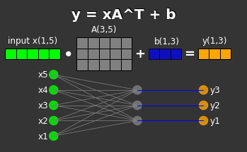

## just a random depository for my AI notes
* #### about_nn.Linear.ipynb - understanding Linear Transformation using PyTorch nn.Linear ([Google Colab](https://colab.research.google.com/github/rashbit/AI_School/blob/main/about_nn.Linear.ipynb))

* #### Transformer/Transformer.ipynb - understanding the Transformer ([Google Colab](https://colab.research.google.com/github/rashbit/AI_School/blob/main/Transformer/Transformer.ipynb))
