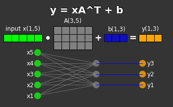

# **random AI notes**


## the ***Transformer*** notebook 
[25 March 2023] 
> Transformer/Transformer.ipynb ([Google Colab](https://colab.research.google.com/github/rashlab/AI-Notes/blob/main/Transformer/Transformer.ipynb))

a mini-GPT model (tiny Shakespeare) with notes I wrote to myself. Based on Andrej Karpathy's [minGPT project](https://github.com/karpathy/minGPT). Thanks Andrej! 

* The model is trained on 1 MB txt file of Shakespeare's writings, and after short training learns to generate new sonnets that, while nonsensical, resemble Shakespeare's style

* The model is using a simple character-level tokenizer, and the vocabulary size is relatively small - 65 unique characters: ```!$&',-.3:;?ABCDEFGHIJKLMNOPQRSTUVWXYZabcdefghijklmnopqrstuvwxyz```

* The model is configured by default to run with 6 Transformer blocks (```C.n_layer```), each with 6 masked self-attention heads (```C.n_head```), and and tokens (characters) embedding size is 192 (```C.n_embed```)

* The model has ~1.1 million learnable parameters, and on a single NVIDIA GeForce RTX 3090 it takes about 5 min to train


```
In void of faith, and show thee men,
That together my daughters in heaven and thy growthry,
So labour'd lineaments are those my speaks,
Strikes tongues, for an ach ancient hests,
If you'll countenance him he all all hers.
Or will we defier it?

BRUTUS:
I'll none, but betimes our flatterer pleasure
Their love, and thine saltier are their halls
After hatches their song. Come, sometimes.

CORIOLANUS:
O groans!
A dog! thousand on this disland of hair,--
We'll be some of good spare out.

CORIOLANUS:
I must confess.
Ha
```


#


## *Linear Transformation with PyTorch nn.Linear*
[22 March 2023] 
>  nn.Linear nn.Linear/nn.Linear.ipynb -  ([Google Colab](https://colab.research.google.com/github/rashlab/AI-Notes/blob/main/nn.Linear/nn.Linear.ipynb))





#


